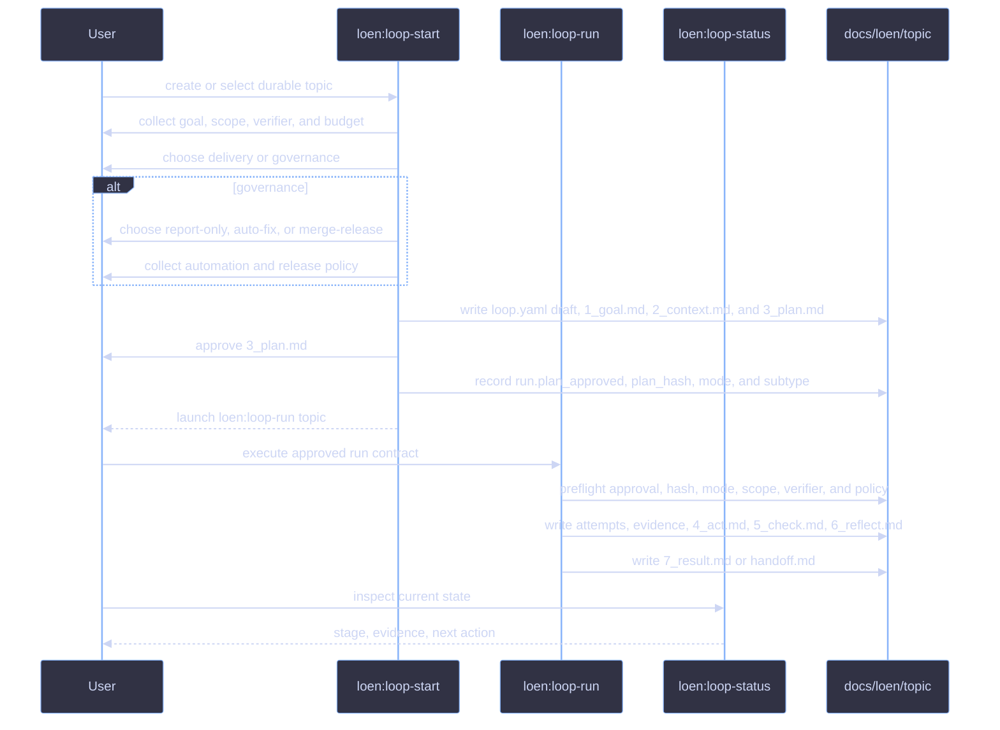
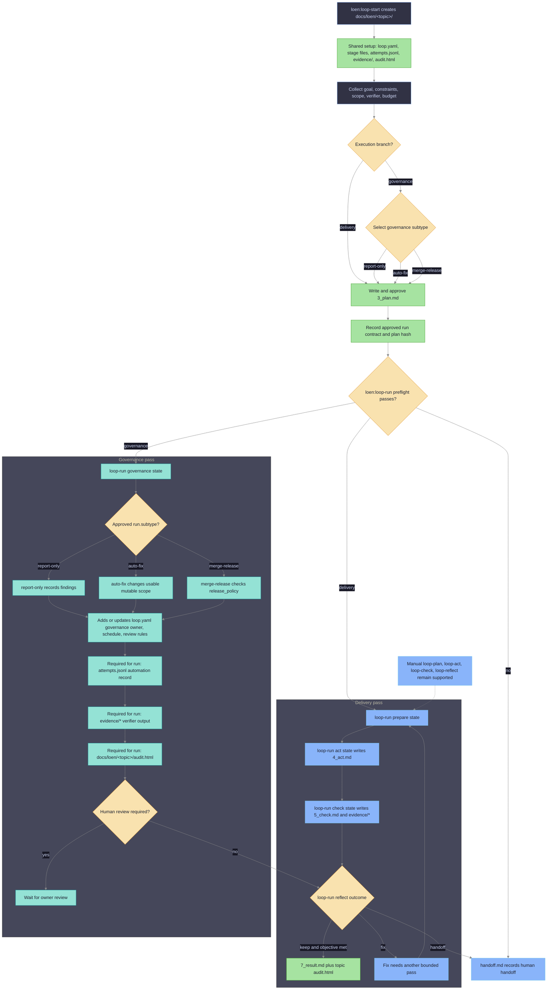

# LoEn Plugin

LoEn is the Loop Engineering plugin source bundled with icodex. It provides
Codex skills, hooks, agents, and templates for durable work loops that keep task
state in repository files instead of chat history.

## What LoEn Adds

- Skills named `loen:loop-start`, `loen:loop-run`, `loen:loop-plan`,
  `loen:loop-act`, `loen:loop-check`, `loen:loop-reflect`, `loen:loop-status`,
  `loen:loop-repair`, `loen:loop-research`, `loen:loop-review`, and
  `loen:loop-governance`.
- Hook scripts that can enforce active loop state, mutable/protected scope,
  role/tool policy, shell/network policy, and final evidence requirements.
- Role agent definitions and context capsules for planner, worker, verifier,
  reviewer, and researcher flows.
- Templates for durable loop artifacts under `docs/loen/<topic>/`.

## Skill Responsibilities

| Skill | Use it when | Responsibility |
|---|---|---|
| `loen:loop-start` | Starting a new loop or selecting a durable topic. | Creates or reuses `docs/loen/<topic>/`, collects the delivery or governance contract, writes `3_plan.md` for approval, then records the approved `run:` contract in `loop.yaml`. |
| `loen:loop-run` | An approved `3_plan.md` should run to a terminal outcome. | Executes the approved run contract through prepare, act, check, and reflect, then writes `7_result.md` or `handoff.md`. |
| `loen:loop-plan` | A goal exists and the loop needs one bounded pass. | Converts `1_goal.md`, `2_context.md`, and `loop.yaml` into `3_plan.md` with exact verification commands. |
| `loen:loop-act` | The active plan has one next action. | Executes one bounded action, then records changed files, commands, and observations in `4_act.md`. |
| `loen:loop-check` | Code, docs, or configuration changed. | Runs planned checks and records exit codes, output summaries, and evidence references in `5_check.md`. |
| `loen:loop-reflect` | Check evidence exists and the loop needs a decision. | Decides keep, fix, revert, or handoff; writes `6_reflect.md` and, when complete, `7_result.md`. |
| `loen:loop-status` | You need the current state of one or more topics. | Reads artifacts, reports current stage, latest evidence, open decisions, and next action. |
| `loen:loop-repair` | Evidence shows a failing test, CI failure, regression, or broken behavior. | Captures failure context, narrows the repair surface, and routes back to planning or action. |
| `loen:loop-research` | The task is an experiment with a measurable question. | Records metrics, baseline, experiment step, check commands, observed results, and decision threshold. |
| `loen:loop-review` | Reviewing a diff, branch, or pull request. | Records review scope, findings, evidence, and final review disposition inside the topic artifacts. |
| `loen:loop-governance` | A topic represents a recurring check, audit, CI triage, eval drift check, or cost/latency comparison. | Records recurrence policy, automation attempts, human-review requirements, verifier evidence, and audit updates. |

## Runtime Enablement in icodex

icodex wires LoEn into each isolated Codex home during normal launch. Install and
update commands stay binary-only and do not configure LoEn.

Control runtime behavior with `ICODEX_LOEN_MODE`:

| Mode | Behavior |
|---|---|
| `off` | Disable LoEn wiring and hooks. |
| `advisory` | Enable skills and non-blocking hook nudges. This is the default. |
| `enforce` | Block missing loop state, stage-order violations, protected paths, and missing evidence. |
| `strict` | Add role, tool, shell/network, and worker/verifier separation checks. |

Example:

```bash
ICODEX_LOEN_MODE=advisory ./icodex.sh
```

## Working With a Loop

Start with `loen:loop-start` to create a topic directory:

```text
docs/loen/<topic>/
```

Guided path:

```text
loen:loop-start -> choose delivery or governance -> approve plan -> loen:loop-run <topic> -> 7_result.md or handoff.md
```

Manual `loen:loop-plan`, `loen:loop-act`, `loen:loop-check`, and
`loen:loop-reflect` remain supported for step-by-step operation, repair, review,
and compatibility with existing topics.

Guided sequence:



## How a Loop Reaches a Solution

The guided delivery loop is driven by `loop-start` and `loop-run`. Manual
`loop-plan`, `loop-act`, `loop-check`, and `loop-reflect` remain available when
you want each step exposed.

Each pass answers one question: did the last bounded action move the topic closer
to the objective with enough evidence to keep it?



1. `loop-plan` narrows the goal to one verifiable action and writes checks into
   `3_plan.md`.
2. `loop-act` performs only that action and records what changed in `4_act.md`.
3. `loop-check` runs or inspects the planned checks and stores evidence in
   `5_check.md` plus `docs/loen/<topic>/evidence/`.
4. `loop-reflect` reads action and check evidence, then chooses one outcome:
   `keep`, `fix`, `revert`, or `handoff`.
5. If the outcome is `fix`, the next pass starts with a narrower plan based on
   the failed evidence.
6. If the outcome is `revert`, the next action restores the scoped change before
   another check.
7. If the outcome is `handoff`, the loop records why it cannot safely continue in
   `handoff.md`.
8. If the outcome is `keep` and the objective is satisfied, `loop-reflect` writes
   `7_result.md`; `audit.html` is regenerated for the topic.

The loop is complete only when the topic has a result and enough check evidence
to justify it. `loop-status` is read-only; it summarizes the current stage and
next action but does not advance the loop.

## Runner Contract

`loop-start` enables `loop-run` only after the user approves `3_plan.md`.
Approval is recorded in `loop.yaml` under `run:`:

```yaml
run:
  mode: delivery
  subtype: null
  plan_approved: true
  plan_hash: "<hash of 3_plan.md>"
  state: prepare
  max_passes: 3
  current_pass: 0
```

`subtype` is the governance subtype selected during `loop-start`. Delivery uses
`subtype: null`; governance requires one of `report-only`, `auto-fix`, or
`merge-release`. `loop-run` does not choose a subtype. It only reads the
approved value and validates the matching policy before acting.

`loop-run` refuses to continue when approval is missing, the plan hash changed,
the mode or subtype is invalid, mutable scope is missing, the verifier command is
missing, the budget is empty, or rollback/recovery policy is incomplete.
Placeholder mutable scope values such as `none`, `null`, or an empty string are
treated as missing scope.

For governance `merge-release`, `release_policy:` must be complete before any
merge or release work:

```yaml
release_policy:
  target_branch: master
  merge_strategy: pr
  verifier_required: true
  evidence_required: true
  scope_limit: "Configured mutable scope only"
  recovery_policy: "Stop, record handoff, and leave branch inspectable."
```

`scope_limit` is a required release boundary, separate from the general
`mutable_scope` list. It records the release-specific limit the runner must obey
when applying merge/release automation.

The topic directory stores:

| Artifact | Purpose |
|---|---|
| `1_goal.md` | User request, objective, and success criterion for the loop. |
| `2_context.md` | Facts, relevant files, constraints, and evidence summaries. |
| `3_plan.md` | Bounded plan and verification commands for one loop pass. |
| `4_act.md` | Action evidence: changed files, commands, and observations. |
| `5_check.md` | Check results, exit codes, and verifier evidence references. |
| `6_reflect.md` | Decision to keep, fix, revert, or hand off. |
| `7_result.md` | Final outcome when the loop is complete. |
| `loop.yaml` | Machine-readable contract: topic, mode, scope, verifier, budget, stop rules, and governance. |
| `attempts.jsonl` | Append-only run log for manual or automated attempts. |
| `evidence/` | Raw check output such as logs, JSON summaries, or verifier files. |
| `handoff.md` | Human handoff state when the loop cannot continue safely. |
| `audit.html` | Regenerated human-readable audit view for this topic at `docs/loen/<topic>/audit.html`. |

Use `loen:loop-status` to inspect current state. Continue with
`loen:loop-plan`, `loen:loop-act`, `loen:loop-check`, and
`loen:loop-reflect` for one bounded pass through the loop.

## Minimal Example

Request:

```text
Use LoEn to fix the failing proxy test.
```

Expected first pass:

```text
loen:loop-start creates docs/loen/fix-proxy-test/
choose delivery
approve 3_plan.md
loen:loop-run fix-proxy-test
runner writes 7_result.md or handoff.md
```

If `ICODEX_LOEN_MODE=enforce`, edits outside the configured mutable scope or a
final answer without check evidence can be blocked by hooks.

## Automation Governance

Use `loen:loop-governance` for recurring or scheduled topics such as CI triage,
dependency audits, eval drift checks, and cost or latency comparisons. It adds
policy around a loop; it does not replace the normal plan, act, check, and
reflect pass.

Governance topics still write ordinary LoEn artifacts under
`docs/loen/<topic>/`, append automation attempts to `attempts.jsonl`, store
verifier output under `evidence/`, and regenerate
`docs/loen/<topic>/audit.html`.

`loop-governance` can run immediately after `loop-start`; it does not require a
completed delivery pass. `loop-start` creates the shared topic artifacts, and
`loop-governance` adds or updates the `governance:` section inside `loop.yaml`.
After that, each governance run requires these artifacts before it can be treated
as recorded:

| Required artifact | Purpose |
|---|---|
| `loop.yaml` `governance:` | Governance policy added to the shared topic contract: owner, schedule, review rules, alert conditions, and safe automation defaults. |
| `attempts.jsonl` | Append-only automation run record with status, summary, evidence path, and review flags. |
| `evidence/` | Verifier output for the scheduled or recurring run. |
| `audit.html` | Topic-scoped audit regenerated at `docs/loen/<topic>/audit.html`. |

Automation is advisory in this plugin source. The default remains no
auto-merge. The `merge-release` subtype may enable
`governance.auto_merge: true` only with explicit start-time approval and a
complete `release_policy:` including `scope_limit`; external branch rules, host
approval prompts, and repository safety gates still apply. Automation must not
perform destructive operations, edit protected scope, or complete first runs
without the human-review requirements recorded in `loop.yaml`.

## Vendoring for Codex

Edit plugin source in this directory. To regenerate the committed Codex cache
used by icodex launch wiring, run:

```bash
./scripts/vendor-loen.sh
```

The script copies this source tree into:

```text
.codex-isolated/plugins/cache/icodex-local/loen/<version>/
```

It validates required assets and strips generated files such as `__pycache__`
and `*.pyc`.

## Boundaries

LoEn is self-contained and does not depend on other workflow plugins. It writes
loop state only under `docs/loen/<topic>/` and updates `docs/TODO.md` as the
global task index. Auto-merge stays disabled by default; only approved
`merge-release` policy may set `governance.auto_merge: true`. LoEn does not
rewrite protected files or bypass `LOEN_MODE`.

Plugin internals are documented in `plugins/loen/docs/architecture.md`.
