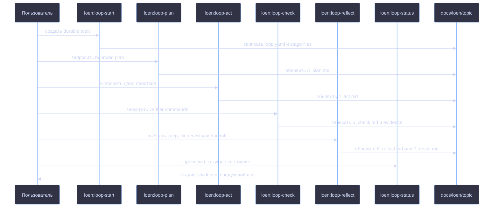

# Плагин LoEn

LoEn — plugin source для Loop Engineering внутри icodex. Он добавляет навыки
Codex, hooks, agents и шаблоны для рабочих циклов, где состояние задачи хранится
в файлах репозитория, а не в истории чата.

## Что добавляет LoEn

- Навыки `loen:loop-start`, `loen:loop-plan`, `loen:loop-act`,
  `loen:loop-check`, `loen:loop-reflect`, `loen:loop-status`,
  `loen:loop-repair`, `loen:loop-research`, `loen:loop-review` и
  `loen:loop-governance`.
- Hooks для контроля active loop state, mutable/protected scope, role/tool
  policy, shell/network policy и обязательных evidence перед финальным
  результатом.
- Agent definitions и context capsules для planner, worker, verifier, reviewer
  и researcher.
- Шаблоны durable loop artifacts в `docs/loen/<topic>/`.

## Ответственность навыков

| Навык | Когда использовать | За что отвечает |
|---|---|---|
| `loen:loop-start` | Нужно начать loop или выбрать durable topic. | Создаёт или переиспользует `docs/loen/<topic>/`, инициализирует `loop.yaml`, stage files, `attempts.jsonl`, `handoff.md`, `audit.html` и `evidence/`. |
| `loen:loop-plan` | Goal уже есть, нужен один bounded pass. | Превращает `1_goal.md`, `2_context.md` и `loop.yaml` в `3_plan.md` с точными verification commands. |
| `loen:loop-act` | В active plan есть одно следующее действие. | Выполняет одно bounded action и записывает changed files, commands и observations в `4_act.md`. |
| `loen:loop-check` | Изменились code, docs или configuration. | Запускает planned checks и пишет exit codes, output summaries и ссылки на evidence в `5_check.md`. |
| `loen:loop-reflect` | Evidence проверок уже есть, нужно решение по loop. | Выбирает keep, fix, revert или handoff; пишет `6_reflect.md`, а при завершении `7_result.md`. |
| `loen:loop-status` | Нужно понять текущее состояние одного или нескольких topics. | Читает artifacts, показывает current stage, latest evidence, open decisions и next action. |
| `loen:loop-repair` | Evidence показывает failing test, CI failure, regression или broken behavior. | Фиксирует failure context, сужает repair surface и возвращает loop к planning/action. |
| `loen:loop-research` | Задача является experiment с measurable question. | Записывает metrics, baseline, experiment step, check commands, observed results и decision threshold. |
| `loen:loop-review` | Нужно review diff, branch или pull request. | Записывает review scope, findings, evidence и final review disposition в topic artifacts. |
| `loen:loop-governance` | Topic описывает recurring check, audit, CI triage, eval drift check или cost/latency comparison. | Фиксирует recurrence policy, automation attempts, human-review requirements, verifier evidence и audit updates. |

## Включение в icodex

icodex подключает LoEn в каждый isolated Codex home при обычном запуске.
Команды install/update остаются binary-only и LoEn не настраивают.

Поведение управляется переменной `ICODEX_LOEN_MODE`:

| Режим | Поведение |
|---|---|
| `off` | Отключить LoEn wiring и hooks. |
| `advisory` | Включить skills и неблокирующие hook-подсказки. Режим по умолчанию. |
| `enforce` | Блокировать отсутствие loop state, нарушения порядка стадий, protected paths и отсутствие evidence. |
| `strict` | Добавить проверки ролей, tools, shell/network и разделения worker/verifier. |

Пример:

```bash
ICODEX_LOEN_MODE=advisory ./icodex.sh
```

## Работа с loop

Начинай с `loen:loop-start`, чтобы создать topic directory:

```text
docs/loen/<topic>/
```

Типовая последовательность:



В topic directory хранятся:

| Artifact | Назначение |
|---|---|
| `1_goal.md` | User request, objective и success criterion для loop. |
| `2_context.md` | Факты, relevant files, constraints и summaries evidence. |
| `3_plan.md` | Bounded plan и verification commands для одного loop pass. |
| `4_act.md` | Action evidence: changed files, commands и observations. |
| `5_check.md` | Check results, exit codes и ссылки на verifier evidence. |
| `6_reflect.md` | Решение keep, fix, revert или handoff. |
| `7_result.md` | Final outcome, когда loop завершён. |
| `loop.yaml` | Machine-readable contract: topic, mode, scope, verifier, budget, stop rules и governance. |
| `attempts.jsonl` | Append-only run log для manual или automated attempts. |
| `evidence/` | Raw check output: logs, JSON summaries или verifier files. |
| `handoff.md` | Human handoff state, если loop нельзя безопасно продолжать. |
| `audit.html` | Regenerated human-readable audit view для topic. |

Для просмотра состояния используй `loen:loop-status`. Для одного bounded pass
через loop используй `loen:loop-plan`, `loen:loop-act`, `loen:loop-check` и
`loen:loop-reflect`.

## Минимальный пример

Запрос:

```text
Use LoEn to fix the failing proxy test.
```

Ожидаемый первый проход:

```text
loen:loop-start creates docs/loen/fix-proxy-test/
loen:loop-plan writes a one-pass plan in 3_plan.md
loen:loop-act changes only the scoped files
loen:loop-check runs the configured test and stores evidence/latest-test.log
loen:loop-reflect records keep/fix/revert/handoff
```

Если `ICODEX_LOEN_MODE=enforce`, hooks могут заблокировать правки вне
configured mutable scope или финальный ответ без check evidence.

## Automation Governance

Используй `loen:loop-governance` для recurring или scheduled topics: CI triage,
dependency audits, eval drift checks, cost/latency comparisons. Governance topics
пишут обычные LoEn artifacts в `docs/loen/<topic>/`, добавляют automation
attempts в `attempts.jsonl`, сохраняют verifier output в `evidence/` и
перегенерируют `audit.html`.

Automation в этом plugin source advisory. Она не должна auto-merge, выполнять
destructive operations, менять protected scope или завершать first runs без
human-review requirements, записанных в `loop.yaml`.

## Vendoring для Codex

Редактируй plugin source в этой директории. Чтобы пересобрать committed Codex
cache, который использует icodex launch wiring, запусти:

```bash
./scripts/vendor-loen.sh
```

Скрипт копирует source tree в:

```text
.codex-isolated/plugins/cache/icodex-local/loen/<version>/
```

Он проверяет обязательные assets и удаляет generated files вроде `__pycache__`
и `*.pyc`.

## Границы

LoEn самодостаточен и не зависит от других workflow plugins. Он пишет loop state
только в `docs/loen/<topic>/` и обновляет `docs/TODO.md` как global task index.
LoEn не делает auto-merge, не переписывает protected files и не обходит
`LOEN_MODE`.

Внутренние детали plugin source описаны в `plugins/loen/docs/architecture.md`.
