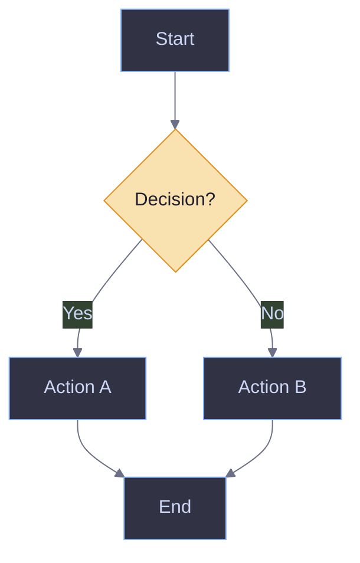
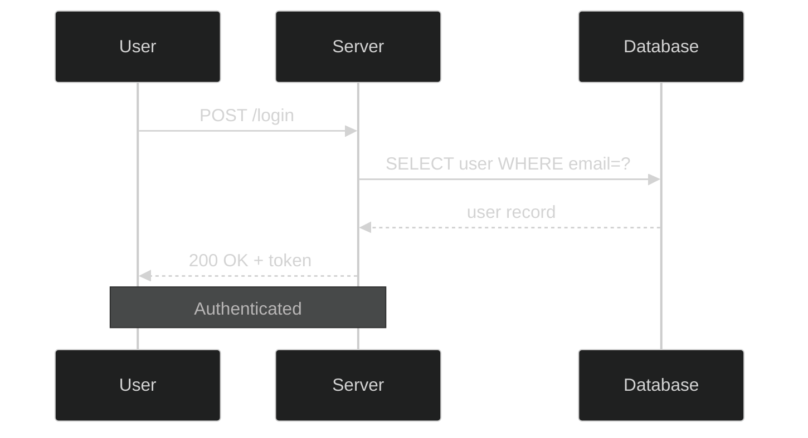
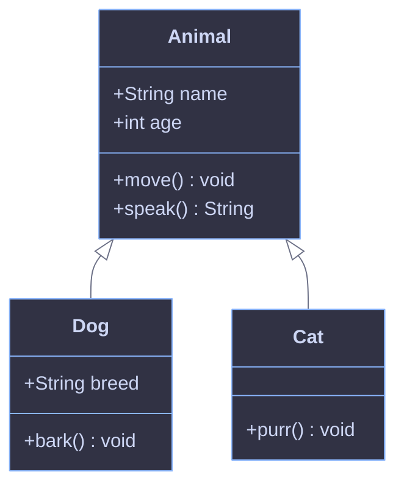
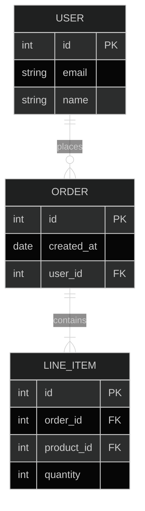
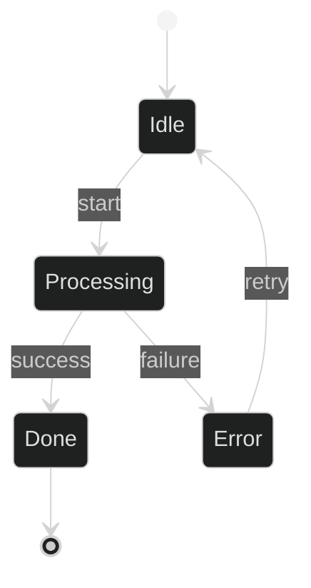
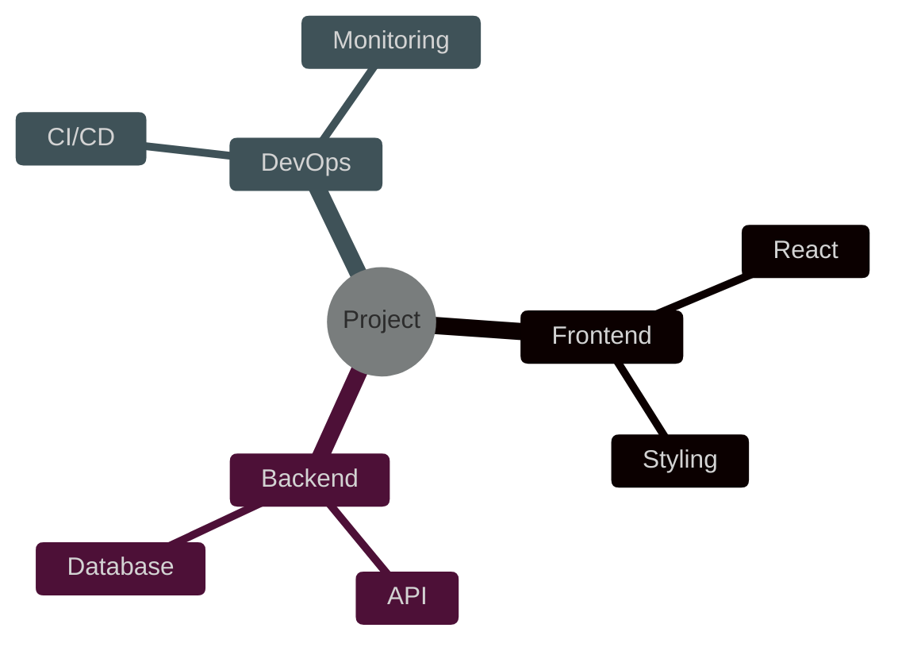
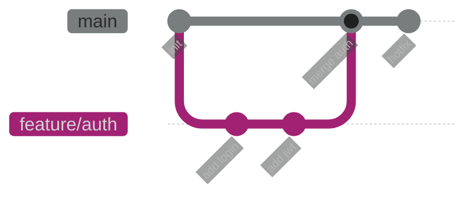
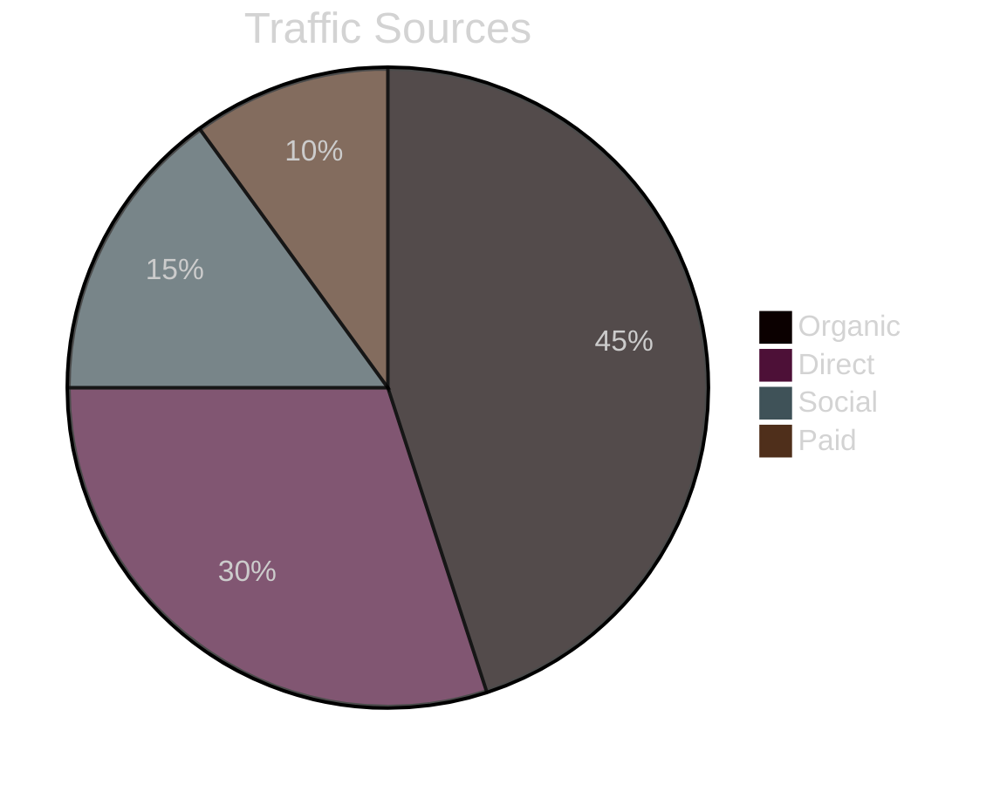
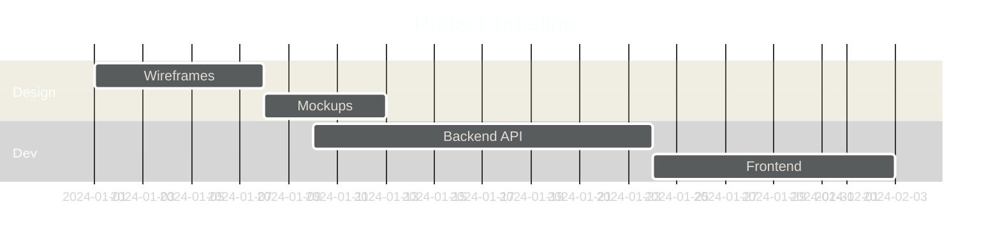
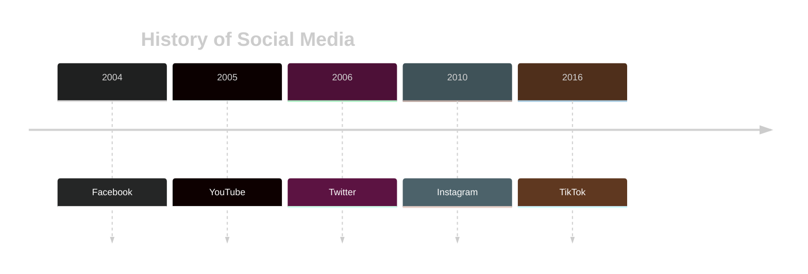

# Mermaid Diagrams for Obsidian

Produce correct, styled Mermaid diagrams that render reliably in Obsidian.

## Subagent Routing

Agent: `diagram-checker`

Use a subagent when a diagram needs syntax linting, Obsidian constraint review, corrected Mermaid drafting, or render-risk notes that would crowd the main context.

Stay in the main context for semantic questions, final diagram text, and file edits.

Return summary:
- decision: `OK`, `needs_work`, or `uncertain`
- evidence: Mermaid lines reviewed, Obsidian constraints checked, and rule violations fixed
- risks: semantic ambiguity, invalid node IDs, unsupported labels, reserved words, contrast issues, or render quirks
- next_action: the smallest main-context action required

Stop rule: if graph semantics are ambiguous, ask the user instead of inventing structure. Main context keeps semantic questions, final diagram text, and file edits.

## Obsidian Constraints (Mermaid 11.4.1)

Obsidian bundles Mermaid 11.4.1. Know these quirks before writing any diagram:

- **Node IDs**: alphanumeric + underscores only — `node_1`, `UserService`, `phase_A`. Never spaces or special chars in IDs.
- **Labels with special chars**: wrap in quotes — `A["Label (with parens)"]`, `B["50% done"]`.
- **Subgraph IDs**: always use the `subgraph id["Title"]` pattern. Bare `subgraph "Title"` causes parse errors.
- **Live Preview vs Reading Mode**: diagrams sometimes appear as empty boxes in Live Preview — this is an Obsidian rendering bug, not a syntax error. Advise the user to switch to Reading Mode if this happens.
- **Multibyte characters**: avoid in node IDs; they can break rendering. Put them only in quoted labels.
- **No `\n` in labels**: the `\n` escape sequence does not work in Mermaid/Obsidian — it renders as literal `\n` text. For line breaks in sequence diagram messages use `<br/>` only where supported; in node labels there is no reliable multiline syntax — keep labels on one line.
- **Reserved keyword `end` in labels**: the word `end` (even inside quoted labels) can confuse the Mermaid 11.4.1 parser and cause a parse error. Replace `end-to-end` with `e2e`, `end state` with `final state`, etc.
- **Numbered labels `1.`, `2.` etc.**: a digit followed by a dot at the start of a label (`"1. Step one"`) is parsed as a markdown ordered list and causes a parse error. Use `1)` instead — `A["1) Step one"]` — or drop the numbering entirely.
- **Quotes in mindmap labels cause `&quot;`**: in `mindmap`, wrapping text in `"..."` makes Mermaid HTML-encode the quotes as `&quot;` in the output. Only quote mindmap labels if the text contains `()[]{}` — otherwise write the text bare: `AGENT.md и CLAUDE.md` not `"AGENT.md и CLAUDE.md"`.
- **Dark text without background is unreadable**: `primaryTextColor` applies to node text, but if a node has no explicit `fill` (e.g. in `timeline` or unstyled mindmap nodes) the text may render dark on a dark background. Always pair a dark theme with explicit `classDef fill` on key nodes, or use `classDef` with both `fill` and `color` to ensure contrast.

## Theme Initialization

Always start diagrams with `%%{init}%%`. Use `base` theme for full color control, `dark` or `default` for quick presets.

**Dark theme** (Catppuccin Mocha palette — ideal for dark Obsidian):
```
%%{init: {'theme': 'base', 'themeVariables': {
  'background': '#1e1e2e',
  'primaryColor': '#313244',
  'primaryTextColor': '#cdd6f4',
  'primaryBorderColor': '#89b4fa',
  'lineColor': '#888888',
  'secondaryColor': '#181825',
  'tertiaryColor': '#45475a'
}}}%%
```

**Light theme** (clean minimal palette):
```
%%{init: {'theme': 'base', 'themeVariables': {
  'background': '#fafafa',
  'primaryColor': '#e8e8f0',
  'primaryTextColor': '#333344',
  'primaryBorderColor': '#5c6bc0',
  'lineColor': '#888888',
  'secondaryColor': '#f0f0f8',
  'tertiaryColor': '#e0e0f0'
}}}%%
```

> **`lineColor: '#888888'`** — средний тон, одинаково виден на тёмном и светлом фоне (~4:1 контраст на обоих). Не используй тёмные (`#333`) или светлые (`#ccc`) цвета соединений — они теряются на соответствующих темах.

**Quick dark preset** (simpler, less control):
```
%%{init: {'theme': 'dark'}}%%
```

## Semantic Color Palettes

Apply colors with `classDef` to communicate meaning visually.

### Dark (Catppuccin Mocha)
```
classDef primary  fill:#89b4fa,color:#1e1e2e,stroke:#74c7ec,stroke-width:2px
classDef success  fill:#a6e3a1,color:#1e1e2e,stroke:#40a02b
classDef warning  fill:#f9e2af,color:#1e1e2e,stroke:#df8e1d
classDef danger   fill:#f38ba8,color:#1e1e2e,stroke:#d20f39
classDef neutral  fill:#585b70,color:#cdd6f4,stroke:#6c7086
classDef info     fill:#94e2d5,color:#1e1e2e,stroke:#179299
```

### Light
```
classDef primary  fill:#c5cae9,color:#1a237e,stroke:#5c6bc0,stroke-width:2px
classDef success  fill:#c8e6c9,color:#1b5e20,stroke:#43a047
classDef warning  fill:#fff3e0,color:#e65100,stroke:#fb8c00
classDef danger   fill:#ffcdd2,color:#b71c1c,stroke:#e53935
classDef neutral  fill:#f5f5f5,color:#424242,stroke:#9e9e9e
classDef info     fill:#b2dfdb,color:#004d40,stroke:#00897b
```

Assign classes to nodes: `class NodeA primary` or `class NodeA,NodeB success`.
For a single node override: `style NodeA fill:#89b4fa,color:#1e1e2e`.

### Semantic coloring in mindmap

Mindmap uses `:::className` inline on each node, then `classDef` at the end of the diagram. Group nodes by domain/semantic meaning, not just visual variety.

```mermaid
%%{init: {'theme': 'base', 'themeVariables': {'background': '#1e1e2e', 'primaryColor': '#313244', 'primaryTextColor': '#cdd6f4', 'primaryBorderColor': '#89b4fa', 'lineColor': '#888888'}}}%%
mindmap
  root((System))
    Config:::config
      rules
      conventions
    Data:::data
      specs
      tracker
    Process:::process
      boot sequence
      warmup
    Templates:::template
      file paths
      acceptance criteria

  classDef config   fill:#89b4fa,color:#1e1e2e,stroke:#74c7ec
  classDef data     fill:#a6e3a1,color:#1e1e2e,stroke:#40a02b
  classDef process  fill:#f9e2af,color:#1e1e2e,stroke:#df8e1d
  classDef template fill:#94e2d5,color:#1e1e2e,stroke:#179299
```

Apply `:::className` only to branch-root nodes (first level under root) — child nodes inherit the context visually through indentation.

## Diagram Templates

### Flowchart


### Sequence Diagram


### Class Diagram


### ER Diagram


### State Diagram


### Mind Map


### Git Graph


### Pie Chart


### Gantt


### Timeline


## Workflow

**Generating a new diagram:**
1. Determine theme (ask if unclear; default to dark for Obsidian).
2. Choose diagram type based on what the user wants to show.
3. Add `%%{init}%%` with appropriate theme variables.
4. Apply semantic `classDef` colors to highlight key nodes.
5. Wrap all labels containing special characters, numbers-only, or spaces in quotes.
6. Use alphanumeric IDs; put display text in labels.
7. Output inside a fenced ` ```mermaid ` block.

**Fixing a broken diagram:**
1. Identify the error: syntax issue, rendering quirk, or missing theme.
2. Fix syntax: quote problematic labels, rename non-alphanumeric IDs, fix subgraph patterns.
3. Add `%%{init}%%` if missing.
4. Return corrected code with a brief explanation of each change.

## Common Errors Reference

| Symptom | Cause | Fix |
|---------|-------|-----|
| Empty box in Live Preview | Obsidian rendering bug | Use Reading Mode |
| `Parse error` near subgraph | Bare `subgraph "Name"` | Use `subgraph id["Name"]` |
| Arrows not rendering | Special chars in node ID | Rename to alphanumeric |
| Colors not applying | No `%%{init}%%` or wrong theme | Add `base` theme init |
| `Undefined` in diagram | Duplicate node IDs | Make all IDs unique |
| Missing last node | Syntax error earlier in diagram | Check for unclosed quotes/brackets |
| Literal `\n` in label | `\n` not supported in Mermaid/Obsidian | Remove `\n`; keep labels single-line |
| Parse error на середине диаграммы | Слово `end` в label (`end-to-end`, `end state`) | Заменить: `e2e`, `final state` и т.д. |
| Parse error при `"1. Label"` | `digit + dot` парсится как markdown list | Использовать `"1) Label"` или убрать нумерацию |
| `&quot;` вместо кавычек в mindmap | Кавычки `"..."` HTML-энкодятся в mindmap | Убрать кавычки; для `()[]{}` в тексте они нужны |
| Тёмный текст без фона нечитаем | `primaryTextColor` не применяется к узлам без `fill` | Добавить `classDef` с явным `fill` и `color` |
| Стрелки не видны на светлой/тёмной теме | `lineColor` слишком тёмный или светлый | Использовать `#888888` (средний тон) |
