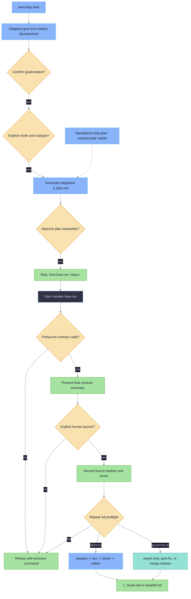

# LoEn Plugin

LoEn is the Loop Engineering plugin source bundled with icodex. It provides
Codex skills, hooks, agents, and templates for durable work loops that keep task
state in repository files instead of chat history.

## What LoEn Adds

- Skills named `loen:loop-start`, `loen:loop-run`, `loen:loop-plan`,
  `loen:loop-act`, `loen:loop-check`, `loen:loop-reflect`, `loen:loop-status`,
  `loen:loop-repair`, `loen:loop-research`, `loen:loop-review`, and
  `loen:loop-governance`.
- Hook scripts that can enforce active loop state, mutable/protected scope,
  role/tool policy, shell/network policy, and final evidence requirements.
- Role agent definitions and context capsules for planner, worker, verifier,
  reviewer, and researcher flows.
- Templates for durable loop artifacts under `docs/loen/<topic>/`.

## Skill Responsibilities

| Skill | Use it when | Responsibility |
|---|---|---|
| `loen:loop-start` | Starting or explicitly renewing a durable topic. | Adaptively develops and confirms goal/context, collects and confirms mode/subtype, integrates planning, records separate plan approval, then stops with `loen:loop-run <topic>`. |
| `loen:loop-run` | A checkpointed topic is ready for a launch decision. | Revalidates the contract, presents its final summary, records explicit human launch confirmation, repeats full preflight, then executes or refuses. |
| `loen:loop-plan` | An existing checkpointed topic needs a replacement plan. | Validates confirmed upstream state, resets plan and launch, writes a fresh `3_plan.md`, and requests fresh plan approval. It is not part of initial start. |
| `loen:loop-act` | The active plan has one next action. | Executes one bounded action, then records changed files, commands, and observations in `4_act.md`. |
| `loen:loop-check` | Code, docs, or configuration changed. | Runs planned checks and records exit codes, output summaries, and evidence references in `5_check.md`. |
| `loen:loop-reflect` | Check evidence exists and the loop needs a decision. | Decides keep, fix, revert, or handoff; writes `6_reflect.md` and, when complete, `7_result.md`. |
| `loen:loop-status` | You need the current state of one or more topics. | Reads artifacts, reports current stage, latest evidence, open decisions, and next action. |
| `loen:loop-repair` | Evidence shows a failing test, CI failure, regression, or broken behavior. | Captures failure context, narrows the repair surface, and routes back to planning or action. |
| `loen:loop-research` | The task is an experiment with a measurable question. | Records metrics, baseline, experiment step, check commands, observed results, and decision threshold. |
| `loen:loop-review` | Reviewing a diff, branch, or pull request. | Records review scope, findings, evidence, and final review disposition inside the topic artifacts. |
| `loen:loop-governance` | A topic represents a recurring check, audit, CI triage, eval drift check, or cost/latency comparison. | Records recurrence policy, automation attempts, human-review requirements, verifier evidence, and audit updates. |

## Runtime Enablement in icodex

icodex wires LoEn into each isolated Codex home during normal launch. Install and
update commands stay binary-only and do not configure LoEn.

Control runtime behavior with `ICODEX_LOEN_MODE`:

| Mode | Behavior |
|---|---|
| `off` | Disable LoEn wiring and hooks. |
| `advisory` | Enable skills and non-blocking hook nudges for active LoEn topics. |
| `enforce` | Block active-topic stage-order violations, protected paths, and missing evidence. |
| `strict` | Add active-topic role, tool, shell/network, and worker/verifier separation checks. |

Unset mode defaults to `off`, so LoEn lifecycle hooks do not run unless you opt in.
When enabled, hook policy is topic-bound: the active topic comes from `LOEN_TOPIC`,
paths under `docs/loen/<topic>/`, or `docs/loen/current`. Ordinary work outside an
active topic is not blocked just because the launch mode is `enforce` or `strict`.

Example:

```bash
ICODEX_LOEN_MODE=advisory ./icodex.sh
```

## Working With a Loop

Start with `loen:loop-start` to create a topic directory:

```text
docs/loen/<topic>/
```

Guided path:

```text
loen:loop-start -> confirm goal/context -> select mode/subtype -> approve integrated plan -> loen:loop-run <topic> -> confirm launch -> repeated preflight -> result or handoff
```

`loop-start` never invokes the runner or offers an immediate launch. It stops
after plan approval with the exact continuation command `loen:loop-run <topic>`.
Standalone `loop-plan` is only for replanning an existing topic; it validates
the confirmed upstream checkpoints, invalidates plan and launch, and requires
fresh plan approval. Manual `loop-act`, `loop-check`, and `loop-reflect` remain
available for step-by-step operation.

Guided sequence:

```mermaid
%%{init: {'theme': 'base', 'themeVariables': {'background': '#1e1e2e', 'primaryColor': '#313244', 'primaryTextColor': '#cdd6f4', 'primaryBorderColor': '#89b4fa', 'lineColor': '#888888', 'secondaryColor': '#181825', 'tertiaryColor': '#45475a'}}}%%
sequenceDiagram
    participant User as User
    participant Start as loen:loop-start
    participant Run as loen:loop-run
    participant Status as loen:loop-status
    participant Files as docs/loen/topic

    User->>Start: create or select durable topic
    Start->>User: adaptively develop goal and context
    Start->>User: confirm goal/context summary
    Start->>Files: record goal_context checkpoint and event
    Start->>User: explicitly choose delivery or governance
    alt governance
        Start->>User: choose report-only, auto-fix, or merge-release
        Start->>User: collect automation and release policy
    end
    Start->>Files: record mode checkpoint and event
    Start->>Files: write integrated 3_plan.md
    Start->>User: approve 3_plan.md
    Start->>Files: record plan checkpoint and event
    Start-->>User: loen:loop-run &lt;topic&gt;
    User->>Run: invoke continuation command
    Run->>Files: prelaunch validation
    Run->>User: present final contract summary and request launch
    User->>Run: explicitly confirm launch
    Run->>Files: record launch hashes and event
    Run->>Files: repeat full preflight; execute or refuse
    Run->>Files: write attempts, evidence, 4_act.md, 5_check.md, 6_reflect.md
    Run->>Files: write 7_result.md or handoff.md
    User->>Status: inspect current state
    Status-->>User: stage, evidence, next action
```

## How a Loop Reaches a Solution

The guided delivery loop is driven by `loop-start` and `loop-run`. Manual
`loop-plan`, `loop-act`, `loop-check`, and `loop-reflect` remain available when
you want each step exposed.

Each pass answers one question: did the last bounded action move the topic closer
to the objective with enough evidence to keep it?



1. Initial planning is integrated into `loop-start`. Standalone `loop-plan`
   replaces the plan only for an existing topic and resets plan and launch.
2. `loop-act` performs only that action and records what changed in `4_act.md`.
3. `loop-check` runs or inspects the planned checks and stores evidence in
   `5_check.md` plus `docs/loen/<topic>/evidence/`.
4. `loop-reflect` reads action and check evidence, then chooses one outcome:
   `keep`, `fix`, `revert`, or `handoff`.
5. If the outcome is `fix`, the next pass starts with a narrower plan based on
   the failed evidence.
6. If the outcome is `revert`, the next action restores the scoped change before
   another check.
7. If the outcome is `handoff`, the loop records why it cannot safely continue in
   `handoff.md`.
8. If the outcome is `keep` and the objective is satisfied, `loop-reflect` writes
   `7_result.md`; `audit.html` is regenerated for the topic.

The loop is complete only when the topic has a result and enough check evidence
to justify it. `loop-status` is read-only; it summarizes the current stage and
next action but does not advance the loop.

## Runner Contract

`loop.yaml` holds current checkpoint authority. `attempts.jsonl` is append-only
history: checkpoint confirmation, invalidation, refusal, and execution events
remain auditable there, but old events never override current checkpoint state.
The `run:` block contains progress fields only, such as state and pass counters.

```yaml
checkpoints:
  goal_context:
    confirmed: true
    goal_hash: "<hash of 1_goal.md>"
    context_hash: "<hash of 2_context.md>"
  mode:
    confirmed: true
    mode: delivery
    subtype: null
  plan:
    approved: true
    plan_hash: "<hash of 3_plan.md>"
  launch:
    confirmed: false
    goal_hash: null
    context_hash: null
    plan_hash: null
```

Checkpoints are ordered: `goal_context`, `mode`, `plan`, then `launch`. Mode is
an explicit `delivery` or `governance` choice; governance also requires an
explicit `report-only`, `auto-fix`, or `merge-release` subtype. No value is
inferred from wording, defaults, prior conversation, or historical events.

| Change | Invalidated checkpoints |
|---|---|
| `1_goal.md` or `2_context.md` content changes | `goal_context`, `mode`, `plan`, `launch` |
| Confirmed mode or subtype changes | `mode`, `plan`, `launch` |
| `3_plan.md` content changes or standalone replan begins | `plan`, `launch` |
| Any launch-bound hash changes | `launch` |

Invoking `loen:loop-run <topic>` is not launch confirmation. The runner first
validates all upstream checkpoints and policy, then presents the final contract
summary. Only a separate explicit human confirmation records `launch.confirmed`
with current goal, context, and plan hashes. The runner immediately repeats the
full preflight against those hashes and either executes or refuses. This
universal launch checkpoint also applies to governance `merge-release`.

`loop-run` refuses to continue when a checkpoint is missing, stale,
contradictory, or out of order; mutable scope or verifier is missing; budget is
empty; or rollback/recovery policy is incomplete.
Placeholder mutable scope values such as `none`, `null`, or an empty string are
treated as missing scope.

Legacy contracts without `checkpoints` are strictly invalid. There is no
migration, inferred approval, compatibility flag, or grandfathering. Renew the
topic through `loen:loop-start`; after plan approval continue with the exact
command `loen:loop-run <topic>`. For a stale plan on an otherwise valid existing
topic, run `loen:loop-plan <topic>`, approve the fresh plan, then run
`loen:loop-run <topic>`.

For governance `merge-release`, `release_policy:` must be complete before any
merge or release work:

```yaml
release_policy:
  target_branch: master
  merge_strategy: pr
  verifier_required: true
  evidence_required: true
  scope_limit: "Configured mutable scope only"
  recovery_policy: "Stop, record handoff, and leave branch inspectable."
```

`scope_limit` is a required release boundary, separate from the general
`mutable_scope` list. It records the release-specific limit the runner must obey
when applying merge/release automation.

The topic directory stores:

| Artifact | Purpose |
|---|---|
| `1_goal.md` | User request, objective, and success criterion for the loop. |
| `2_context.md` | Facts, relevant files, constraints, and evidence summaries. |
| `3_plan.md` | Bounded plan and verification commands for one loop pass. |
| `4_act.md` | Action evidence: changed files, commands, and observations. |
| `5_check.md` | Check results, exit codes, and verifier evidence references. |
| `6_reflect.md` | Decision to keep, fix, revert, or hand off. |
| `7_result.md` | Final outcome when the loop is complete. |
| `loop.yaml` | Machine-readable current authority: ordered checkpoints, scope, verifier, budget, stop rules, progress, and governance. |
| `attempts.jsonl` | Append-only attempt and checkpoint-event history; never current approval authority. |
| `evidence/` | Raw check output such as logs, JSON summaries, or verifier files. |
| `handoff.md` | Human handoff state when the loop cannot continue safely. |
| `audit.html` | Regenerated human-readable audit view for this topic at `docs/loen/<topic>/audit.html`. |

Use `loen:loop-status` to inspect current state. Use standalone
`loen:loop-plan <topic>` only to replan an existing checkpointed topic. Manual
`loop-act`, `loop-check`, and `loop-reflect` remain available for a bounded pass.

## Minimal Example

Request:

```text
Use LoEn to fix the failing proxy test.
```

Expected first pass:

```text
loen:loop-start creates docs/loen/fix-proxy-test/
choose delivery
approve 3_plan.md
loen:loop-run fix-proxy-test
explicitly confirm launch after the final contract summary
runner writes 7_result.md or handoff.md
```

If `ICODEX_LOEN_MODE=enforce`, edits outside the active topic's configured mutable
scope or a final answer without check evidence can be blocked by hooks. Without an
active topic, ordinary session edits pass through.

## Automation Governance

Use `loen:loop-governance` for recurring or scheduled topics such as CI triage,
dependency audits, eval drift checks, and cost or latency comparisons. It adds
policy around a loop; it does not replace the normal plan, act, check, and
reflect pass.

Governance topics still write ordinary LoEn artifacts under
`docs/loen/<topic>/`, append automation attempts to `attempts.jsonl`, store
verifier output under `evidence/`, and regenerate
`docs/loen/<topic>/audit.html`.

`loop-governance` adds or updates the `governance:` section inside `loop.yaml`,
but governance execution still requires the universal `loop-run` launch
checkpoint. Plan approval or runner invocation alone never authorizes a
governance run. Each governance run requires these artifacts before it can be
treated as recorded:

| Required artifact | Purpose |
|---|---|
| `loop.yaml` `governance:` | Governance policy added to the shared topic contract: owner, schedule, review rules, alert conditions, and safe automation defaults. |
| `attempts.jsonl` | Append-only automation run record with status, summary, evidence path, and review flags. |
| `evidence/` | Verifier output for the scheduled or recurring run. |
| `audit.html` | Topic-scoped audit regenerated at `docs/loen/<topic>/audit.html`. |

Automation is advisory in this plugin source. The default remains no
auto-merge. The `merge-release` subtype may enable
`governance.auto_merge: true` only with confirmed mode policy, the universal
explicit launch checkpoint, repeated preflight, and a complete `release_policy:`
including `scope_limit`; external branch rules, host
approval prompts, and repository safety gates still apply. Automation must not
perform destructive operations, edit protected scope, or complete first runs
without the human-review requirements recorded in `loop.yaml`.

## Vendoring for Codex

Edit plugin source in this directory. To regenerate the committed Codex cache
used by icodex launch wiring, run:

```bash
./scripts/vendor-loen.sh
```

The script copies this source tree into:

```text
.codex-isolated/plugins/cache/ikeniborn/loen/<version>/
```

It validates required assets and strips generated files such as `__pycache__`
and `*.pyc`.

## Boundaries

LoEn is self-contained and does not depend on other workflow plugins. It writes
loop state only under `docs/loen/<topic>/` and updates `docs/TODO.md` as the
global task index. The LoEn lifecycle is complete on its own; cross-workflow
validation is opt-in for separate work. Auto-merge stays disabled by default;
only approved
`merge-release` policy may set `governance.auto_merge: true`. LoEn does not
rewrite protected files or bypass `LOEN_MODE`.

Plugin internals are documented in `plugins/loen/docs/architecture.md`.
