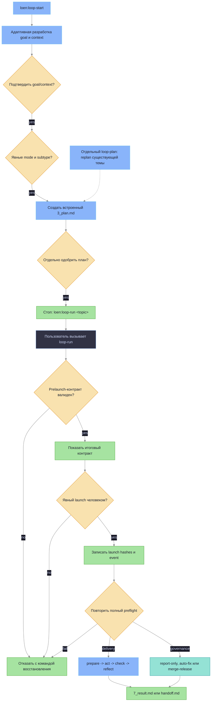

# Плагин LoEn

LoEn — исходник плагина для Loop Engineering внутри icodex. Он добавляет навыки
Codex, хуки, определения агентов и шаблоны для рабочих циклов, где состояние
задачи хранится в файлах репозитория, а не в истории чата.

## Что добавляет LoEn

- Навыки `loen:loop-start`, `loen:loop-run`, `loen:loop-plan`,
  `loen:loop-act`, `loen:loop-check`, `loen:loop-reflect`, `loen:loop-status`,
  `loen:loop-repair`, `loen:loop-research`, `loen:loop-review` и
  `loen:loop-governance`.
- Хуки для контроля активного состояния loop, изменяемой и защищённой области,
  правил ролей и инструментов, правил командной оболочки и сети, а также
  обязательных evidence перед финальным результатом.
- Определения агентов и контекстные капсулы для planner, worker, verifier,
  reviewer и researcher.
- Шаблоны устойчивых артефактов loop в `docs/loen/<topic>/`.

## Ответственность навыков

| Навык | Когда использовать | За что отвечает |
|---|---|---|
| `loen:loop-start` | Нужно начать или явно обновить устойчивую тему. | Адаптивно разрабатывает и подтверждает goal/context, собирает и подтверждает mode/subtype, включает planning, отдельно фиксирует одобрение плана и останавливается с `loen:loop-run <topic>`. |
| `loen:loop-run` | Тема с checkpoints готова к решению о запуске. | Повторно проверяет контракт, показывает итоговую сводку, фиксирует явное подтверждение запуска человеком, повторяет полный preflight и затем исполняет или отказывает. |
| `loen:loop-plan` | Существующей теме с checkpoints нужен новый план. | Проверяет подтверждённые upstream checkpoints, сбрасывает plan и launch, пишет новый `3_plan.md` и запрашивает новое одобрение плана. Не используется при первичном старте. |
| `loen:loop-act` | В активном плане есть одно следующее действие. | Выполняет одно ограниченное действие и записывает изменённые файлы, команды и наблюдения в `4_act.md`. |
| `loen:loop-check` | Изменились код, документация или конфигурация. | Запускает запланированные проверки и пишет коды выхода, краткие итоги вывода и ссылки на evidence в `5_check.md`. |
| `loen:loop-reflect` | Evidence проверок уже есть, нужно решение по loop. | Выбирает keep, fix, revert или handoff; пишет `6_reflect.md`, а при завершении `7_result.md`. |
| `loen:loop-status` | Нужно понять текущее состояние одной или нескольких тем. | Читает артефакты, показывает текущую стадию, последнее evidence, открытые решения и следующее действие. |
| `loen:loop-repair` | Evidence показывает падающий тест, сбой CI, regression или broken behavior. | Фиксирует контекст сбоя, сужает область ремонта и возвращает loop к planning/action. |
| `loen:loop-research` | Задача является экспериментом с измеримым вопросом. | Записывает metrics, baseline, experiment step, команды проверки, observed results и decision threshold. |
| `loen:loop-review` | Нужно ревью diff, branch или pull request. | Записывает область ревью, findings, evidence и итоговый статус ревью в артефактах темы. |
| `loen:loop-governance` | Тема описывает повторяющуюся проверку, audit, CI triage, eval drift check или cost/latency comparison. | Фиксирует правила периодичности, попытки автоматизации, требования human review, verifier evidence и обновления audit. |

## Включение в icodex

icodex подключает LoEn в каждый изолированный Codex home при обычном запуске.
Команды install/update работают только с бинарником и LoEn не настраивают.

Поведение управляется переменной `ICODEX_LOEN_MODE`:

| Режим | Поведение |
|---|---|
| `off` | Отключить подключение LoEn и хуки. |
| `advisory` | Включить skills и неблокирующие подсказки хуков для активных LoEn-тем. |
| `enforce` | Блокировать нарушения порядка стадий, protected paths и отсутствие evidence внутри активной темы. |
| `strict` | Добавить проверки ролей, инструментов, shell/network и разделения worker/verifier внутри активной темы. |

Если режим не задан, используется `off`, поэтому lifecycle hooks LoEn не запускаются без явного включения.
Когда режим включён, политика хуков привязана к теме: активная тема берётся из
`LOEN_TOPIC`, путей `docs/loen/<topic>/` или `docs/loen/current`. Обычная работа вне
активной темы не блокируется только из-за launch mode `enforce` или `strict`.

Пример:

```bash
ICODEX_LOEN_MODE=advisory ./icodex.sh
```

## Работа с loop

Начинай с `loen:loop-start`, чтобы создать директорию темы:

```text
docs/loen/<topic>/
```

Путь с мастером запуска:

```text
loen:loop-start -> подтвердить goal/context -> выбрать mode/subtype -> одобрить встроенный план -> loen:loop-run <topic> -> подтвердить launch -> повторный preflight -> result или handoff
```

`loop-start` никогда не вызывает runner и не предлагает немедленный запуск. После
одобрения плана он останавливается с точной командой продолжения
`loen:loop-run <topic>`. Отдельный `loop-plan` служит только для replanning
существующей темы: проверяет upstream checkpoints, инвалидирует plan и launch и
требует нового одобрения плана. Ручные `loop-act`, `loop-check` и
`loop-reflect` остаются доступны для пошаговой работы.

Последовательность с мастером запуска:

```mermaid
%%{init: {'theme': 'base', 'themeVariables': {'background': '#1e1e2e', 'primaryColor': '#313244', 'primaryTextColor': '#cdd6f4', 'primaryBorderColor': '#89b4fa', 'lineColor': '#888888', 'secondaryColor': '#181825', 'tertiaryColor': '#45475a'}}}%%
sequenceDiagram
    participant User as Пользователь
    participant Start as loen:loop-start
    participant Run as loen:loop-run
    participant Status as loen:loop-status
    participant Files as docs/loen/topic

    User->>Start: создать или выбрать устойчивую тему
    Start->>User: адаптивно разработать goal и context
    Start->>User: подтвердить сводку goal/context
    Start->>Files: записать checkpoint goal_context и event
    Start->>User: явно выбрать delivery или governance
    alt governance
        Start->>User: выбрать report-only, auto-fix или merge-release
        Start->>User: собрать automation и release policy
    end
    Start->>Files: записать checkpoint mode и event
    Start->>Files: записать встроенный 3_plan.md
    Start->>User: одобрить 3_plan.md
    Start->>Files: записать checkpoint plan и event
    Start-->>User: loen:loop-run topic
    User->>Run: вызвать команду продолжения
    Run->>Files: выполнить prelaunch-проверку
    Run->>User: показать итоговый контракт и запросить launch
    User->>Run: явно подтвердить launch
    Run->>Files: записать launch hashes и event
    Run->>Files: повторить полный preflight; исполнить или отказать
    Run->>Files: записать attempts, evidence, 4_act.md, 5_check.md, 6_reflect.md
    Run->>Files: записать 7_result.md или handoff.md
    User->>Status: проверить текущее состояние
    Status-->>User: стадия, evidence, следующий шаг
```

## Как loop доходит до решения

Путь с мастером запуска ведут `loop-start` и `loop-run`. Ручные
`loop-plan`, `loop-act`, `loop-check` и `loop-reflect` остаются доступными,
когда нужно видеть каждый шаг отдельно.

Каждый проход отвечает на один вопрос: приблизило ли последнее ограниченное
действие тему к цели, и достаточно ли evidence, чтобы оставить результат?



1. Первичное planning встроено в `loop-start`. Отдельный `loop-plan` заменяет
   план только существующей темы и сбрасывает plan и launch.
2. `loop-act` выполняет только это действие и записывает изменения в `4_act.md`.
3. `loop-check` запускает или анализирует запланированные проверки и сохраняет evidence в
   `5_check.md` плюс `docs/loen/<topic>/evidence/`.
4. `loop-reflect` читает evidence действия и проверок, затем выбирает outcome: `keep`,
   `fix`, `revert` или `handoff`.
5. Если outcome равен `fix`, следующий проход начинается с более узкого плана на
   основе evidence сбоя.
6. Если outcome равен `revert`, следующее действие откатывает scoped change перед
   новой проверкой.
7. Если outcome равен `handoff`, loop записывает в `handoff.md`, почему нельзя
   безопасно продолжать.
8. Если outcome равен `keep` и цель достигнута, `loop-reflect` пишет
   `7_result.md`; `audit.html` перегенерируется для topic.

Loop завершён только когда у темы есть результат и достаточно evidence проверок,
чтобы его обосновать. `loop-status` работает только на чтение: он показывает
текущую стадию и следующее действие, но не двигает loop вперёд.

## Контракт запуска

`loop.yaml` хранит текущий checkpoint authority. `attempts.jsonl` — append-only
история: события подтверждения, invalidation, отказа и исполнения остаются в
аудите, но старые события никогда не переопределяют текущее состояние
checkpoints. Блок `run:` содержит только progress fields.

```yaml
checkpoints:
  goal_context:
    confirmed: true
    goal_hash: "<hash of 1_goal.md>"
    context_hash: "<hash of 2_context.md>"
  mode:
    confirmed: true
    mode: delivery
    subtype: null
  plan:
    approved: true
    plan_hash: "<hash of 3_plan.md>"
  launch:
    confirmed: false
    goal_hash: null
    context_hash: null
    plan_hash: null
```

Checkpoints упорядочены: `goal_context`, `mode`, `plan`, затем `launch`. Mode
выбирается явно между `delivery` и `governance`; для governance также нужен
явный subtype `report-only`, `auto-fix` или `merge-release`. Значения нельзя
выводить из текста задачи, defaults, предыдущего диалога или старых событий.

| Изменение | Инвалидируемые checkpoints |
|---|---|
| Изменилось содержимое `1_goal.md` или `2_context.md` | `goal_context`, `mode`, `plan`, `launch` |
| Изменился подтверждённый mode или subtype | `mode`, `plan`, `launch` |
| Изменилось содержимое `3_plan.md` или начался отдельный replan | `plan`, `launch` |
| Изменился любой hash, к которому привязан launch | `launch` |

Вызов `loen:loop-run <topic>` не является подтверждением запуска. Runner сначала
проверяет upstream checkpoints и policy, затем показывает итоговую сводку
контракта. Только отдельное явное подтверждение человеком записывает
`launch.confirmed` с текущими goal, context и plan hashes. Runner сразу повторяет
полный preflight по этим hashes и либо исполняет контракт, либо отказывает.
Универсальный launch checkpoint обязателен и для governance `merge-release`.

`loop-run` останавливается, если checkpoint отсутствует, устарел, противоречив
или нарушает порядок; изменяемая область не задана; команда verifier
отсутствует; budget пустой; либо policy rollback/recovery неполная. Значения изменяемой
области вроде `none`, `null` или пустой строки считаются отсутствующей областью.

Legacy-контракты без `checkpoints` строго невалидны. Миграции, inferred approval,
compatibility flag и grandfathering нет. Тему нужно явно обновить через
`loen:loop-start`, а после одобрения плана продолжить точной командой
`loen:loop-run <topic>`. Для устаревшего плана в остальном валидной существующей
темы выполни `loen:loop-plan <topic>`, одобри новый план, затем выполни
`loen:loop-run <topic>`.

Для governance `merge-release` секция `release_policy:` должна быть полной до
любого merge или release:

```yaml
release_policy:
  target_branch: master
  merge_strategy: pr
  verifier_required: true
  evidence_required: true
  scope_limit: "Configured mutable scope only"
  recovery_policy: "Stop, record handoff, and leave branch inspectable."
```

`scope_limit` — обязательная граница release, отдельная от общего списка
`mutable_scope`. Она фиксирует границу конкретного release-запуска, которую
runner должен соблюдать при автоматизации merge/release.

В директории темы хранятся:

| Артефакт | Назначение |
|---|---|
| `1_goal.md` | Запрос пользователя, цель и критерий успеха для loop. |
| `2_context.md` | Факты, важные файлы, ограничения и краткие итоги evidence. |
| `3_plan.md` | Ограниченный план и команды проверки для одного прохода loop. |
| `4_act.md` | Evidence действия: изменённые файлы, команды и наблюдения. |
| `5_check.md` | Результаты проверок, коды выхода и ссылки на verifier evidence. |
| `6_reflect.md` | Решение keep, fix, revert или handoff. |
| `7_result.md` | Итоговый результат, когда loop завершён. |
| `loop.yaml` | Текущий машиночитаемый authority: ordered checkpoints, scope, verifier, budget, stop rules, progress и governance. |
| `attempts.jsonl` | Append-only история попыток и checkpoint events; никогда не текущий approval authority. |
| `evidence/` | Сырой вывод проверок: логи, JSON-сводки или файлы verifier. |
| `handoff.md` | Состояние передачи человеку, если loop нельзя безопасно продолжать. |
| `audit.html` | Перегенерированное человекочитаемое audit-представление для этой темы по пути `docs/loen/<topic>/audit.html`. |

Для просмотра состояния используй `loen:loop-status`. Отдельный
`loen:loop-plan <topic>` используй только для replanning существующей темы с
checkpoints. Ручные `loop-act`, `loop-check` и `loop-reflect` остаются доступны.

## Минимальный пример

Запрос:

```text
Use LoEn to fix the failing proxy test.
```

Ожидаемый первый проход:

```text
loen:loop-start создаёт docs/loen/fix-proxy-test/
выбрать delivery
одобрить 3_plan.md
loen:loop-run fix-proxy-test
явно подтвердить launch после итоговой сводки контракта
запуск записывает 7_result.md или handoff.md
```

Если `ICODEX_LOEN_MODE=enforce`, хуки могут заблокировать правки вне настроенной
изменяемой области активной темы или финальный ответ без evidence проверок. Без
активной темы обычные правки проходят.

## Automation Governance

Используй `loen:loop-governance` для повторяющихся или запланированных тем:
CI triage, dependency audits, eval drift checks, cost/latency comparisons. Он
добавляет правила вокруг loop, но не заменяет обычный проход: plan, act, check,
reflect.

Governance-темы пишут обычные артефакты LoEn в `docs/loen/<topic>/`,
добавляют попытки автоматизации в `attempts.jsonl`, сохраняют вывод verifier в
`evidence/` и перегенерируют `docs/loen/<topic>/audit.html`.

`loop-governance` добавляет или обновляет секцию `governance:` внутри
`loop.yaml`, но governance-исполнение всё равно требует универсальный launch
checkpoint в `loop-run`. Одобрение плана или сам вызов runner не авторизует
governance-запуск. Каждый governance-запуск требует эти артефакты, прежде чем
его можно считать записанным:

| Обязательный артефакт | Назначение |
|---|---|
| `loop.yaml` `governance:` | Правила governance в общем контракте темы: owner, schedule, review rules, alert conditions и безопасные значения автоматизации по умолчанию. |
| `attempts.jsonl` | Запись запуска автоматизации, дописываемая только в конец, со status, summary, evidence path и review flags. |
| `evidence/` | Вывод verifier для запланированного или повторяющегося запуска. |
| `audit.html` | Audit для конкретной темы по пути `docs/loen/<topic>/audit.html`. |

Автоматизация в этом исходнике плагина работает в advisory-режиме. По умолчанию
auto-merge отключён. Подтип `merge-release` может включить
`governance.auto_merge: true` только при подтверждённой mode policy,
универсальном явном launch checkpoint, повторном preflight и полной секции
`release_policy:`, включая `scope_limit`; внешние правила веток,
запросы подтверждения от среды выполнения и правила безопасности репозитория всё
равно применяются. Автоматизация не должна выполнять разрушительные операции,
менять protected scope или завершать первые запуски без требований human review,
записанных в `loop.yaml`.

## Vendoring для Codex

Редактируй исходник плагина в этой директории. Чтобы пересобрать зафиксированный
Codex cache, который использует подключение при запуске icodex, запусти:

```bash
./scripts/vendor-loen.sh
```

Скрипт копирует дерево исходников в:

```text
.codex-isolated/plugins/cache/ikeniborn/loen/<version>/
```

Он проверяет обязательные assets и удаляет сгенерированные файлы вроде `__pycache__`
и `*.pyc`.

## Границы

LoEn самодостаточен и не зависит от других workflow-плагинов. Он пишет состояние
loop только в `docs/loen/<topic>/` и обновляет `docs/TODO.md` как общий индекс задач.
Жизненный цикл LoEn полон сам по себе; cross-workflow validation включается только
явным выбором для отдельной работы. Auto-merge по умолчанию отключён; только одобренная политика для
`merge-release` может установить `governance.auto_merge: true`. LoEn не
переписывает protected files и не обходит `LOEN_MODE`.

Внутренние детали исходника плагина описаны в `plugins/loen/docs/architecture.md`.
