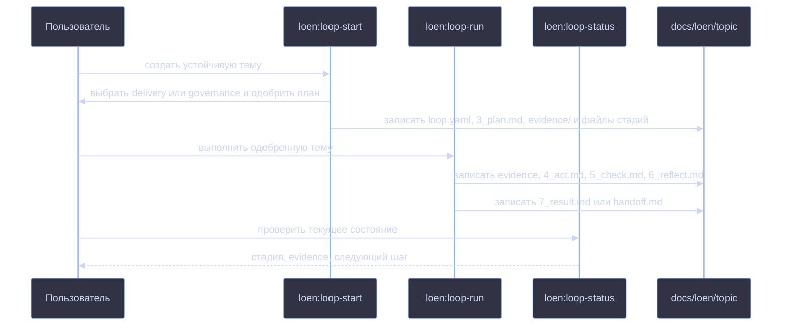
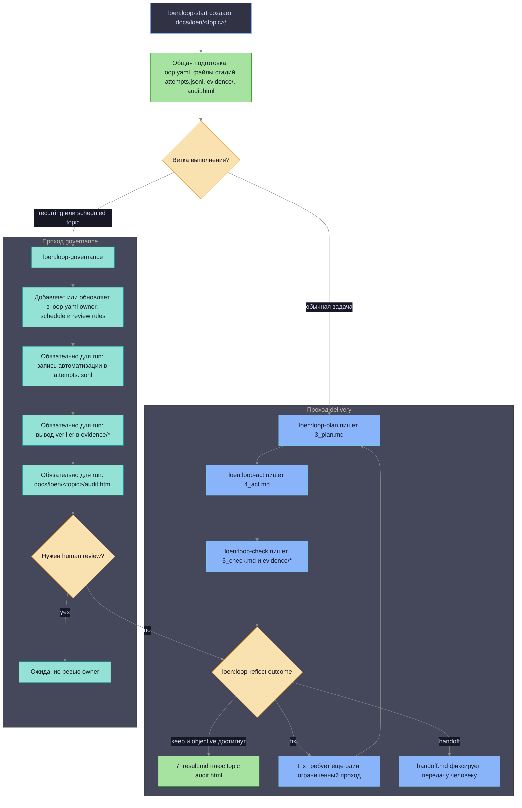

# Плагин LoEn

LoEn — исходник плагина для Loop Engineering внутри icodex. Он добавляет навыки
Codex, хуки, определения агентов и шаблоны для рабочих циклов, где состояние
задачи хранится в файлах репозитория, а не в истории чата.

## Что добавляет LoEn

- Навыки `loen:loop-start`, `loen:loop-run`, `loen:loop-plan`,
  `loen:loop-act`, `loen:loop-check`, `loen:loop-reflect`, `loen:loop-status`,
  `loen:loop-repair`, `loen:loop-research`, `loen:loop-review` и
  `loen:loop-governance`.
- Хуки для контроля активного состояния loop, изменяемой и защищённой области,
  правил ролей и инструментов, правил командной оболочки и сети, а также
  обязательных evidence перед финальным результатом.
- Определения агентов и контекстные капсулы для planner, worker, verifier,
  reviewer и researcher.
- Шаблоны устойчивых артефактов loop в `docs/loen/<topic>/`.

## Ответственность навыков

| Навык | Когда использовать | За что отвечает |
|---|---|---|
| `loen:loop-start` | Нужно начать loop или выбрать устойчивую тему. | Создаёт или переиспользует `docs/loen/<topic>/`, собирает контракт запуска для `delivery` или `governance`, пишет `3_plan.md` на одобрение и затем фиксирует одобренный блок `run:` в `loop.yaml`. |
| `loen:loop-run` | Одобренный `3_plan.md` нужно довести до конечного результата. | Исполняет одобренный блок `run:` через стадии prepare, act, check и reflect, затем пишет `7_result.md` или `handoff.md`. |
| `loen:loop-plan` | Цель уже есть, нужен один ограниченный проход. | Превращает `1_goal.md`, `2_context.md` и `loop.yaml` в `3_plan.md` с точными командами проверки. |
| `loen:loop-act` | В активном плане есть одно следующее действие. | Выполняет одно ограниченное действие и записывает изменённые файлы, команды и наблюдения в `4_act.md`. |
| `loen:loop-check` | Изменились код, документация или конфигурация. | Запускает запланированные проверки и пишет коды выхода, краткие итоги вывода и ссылки на evidence в `5_check.md`. |
| `loen:loop-reflect` | Evidence проверок уже есть, нужно решение по loop. | Выбирает keep, fix, revert или handoff; пишет `6_reflect.md`, а при завершении `7_result.md`. |
| `loen:loop-status` | Нужно понять текущее состояние одной или нескольких тем. | Читает артефакты, показывает текущую стадию, последнее evidence, открытые решения и следующее действие. |
| `loen:loop-repair` | Evidence показывает падающий тест, сбой CI, regression или broken behavior. | Фиксирует контекст сбоя, сужает область ремонта и возвращает loop к planning/action. |
| `loen:loop-research` | Задача является экспериментом с измеримым вопросом. | Записывает metrics, baseline, experiment step, команды проверки, observed results и decision threshold. |
| `loen:loop-review` | Нужно ревью diff, branch или pull request. | Записывает область ревью, findings, evidence и итоговый статус ревью в артефактах темы. |
| `loen:loop-governance` | Тема описывает повторяющуюся проверку, audit, CI triage, eval drift check или cost/latency comparison. | Фиксирует правила периодичности, попытки автоматизации, требования human review, verifier evidence и обновления audit. |

## Включение в icodex

icodex подключает LoEn в каждый изолированный Codex home при обычном запуске.
Команды install/update работают только с бинарником и LoEn не настраивают.

Поведение управляется переменной `ICODEX_LOEN_MODE`:

| Режим | Поведение |
|---|---|
| `off` | Отключить подключение LoEn и хуки. |
| `advisory` | Включить skills и неблокирующие подсказки хуков. Режим по умолчанию. |
| `enforce` | Блокировать отсутствие состояния loop, нарушения порядка стадий, protected paths и отсутствие evidence. |
| `strict` | Добавить проверки ролей, инструментов, shell/network и разделения worker/verifier. |

Пример:

```bash
ICODEX_LOEN_MODE=advisory ./icodex.sh
```

## Работа с loop

Начинай с `loen:loop-start`, чтобы создать директорию темы:

```text
docs/loen/<topic>/
```

Путь с мастером запуска:

```text
loen:loop-start -> выбрать delivery или governance -> одобрить план -> loen:loop-run <topic> -> 7_result.md или handoff.md
```

Ручные шаги `loen:loop-plan`, `loen:loop-act`, `loen:loop-check` и
`loen:loop-reflect` остаются поддержанными для пошаговой работы, исправлений,
ревью и совместимости с уже существующими темами.

Последовательность с мастером запуска:



## Как loop доходит до решения

Путь с мастером запуска ведут `loop-start` и `loop-run`. Ручные
`loop-plan`, `loop-act`, `loop-check` и `loop-reflect` остаются доступными,
когда нужно видеть каждый шаг отдельно.

Каждый проход отвечает на один вопрос: приблизило ли последнее ограниченное
действие тему к цели, и достаточно ли evidence, чтобы оставить результат?



1. `loop-plan` сужает цель до одного проверяемого действия и пишет проверки в
   `3_plan.md`.
2. `loop-act` выполняет только это действие и записывает изменения в `4_act.md`.
3. `loop-check` запускает или анализирует запланированные проверки и сохраняет evidence в
   `5_check.md` плюс `docs/loen/<topic>/evidence/`.
4. `loop-reflect` читает evidence действия и проверок, затем выбирает outcome: `keep`,
   `fix`, `revert` или `handoff`.
5. Если outcome равен `fix`, следующий проход начинается с более узкого плана на
   основе evidence сбоя.
6. Если outcome равен `revert`, следующее действие откатывает scoped change перед
   новой проверкой.
7. Если outcome равен `handoff`, loop записывает в `handoff.md`, почему нельзя
   безопасно продолжать.
8. Если outcome равен `keep` и цель достигнута, `loop-reflect` пишет
   `7_result.md`; `audit.html` перегенерируется для topic.

Loop завершён только когда у темы есть результат и достаточно evidence проверок,
чтобы его обосновать. `loop-status` работает только на чтение: он показывает
текущую стадию и следующее действие, но не двигает loop вперёд.

В директории темы хранятся:

| Артефакт | Назначение |
|---|---|
| `1_goal.md` | Запрос пользователя, цель и критерий успеха для loop. |
| `2_context.md` | Факты, важные файлы, ограничения и краткие итоги evidence. |
| `3_plan.md` | Ограниченный план и команды проверки для одного прохода loop. |
| `4_act.md` | Evidence действия: изменённые файлы, команды и наблюдения. |
| `5_check.md` | Результаты проверок, коды выхода и ссылки на verifier evidence. |
| `6_reflect.md` | Решение keep, fix, revert или handoff. |
| `7_result.md` | Итоговый результат, когда loop завершён. |
| `loop.yaml` | Машиночитаемый контракт: topic, mode, scope, verifier, budget, stop rules и governance. |
| `attempts.jsonl` | Журнал запусков, дописываемый только в конец, для ручных или автоматических попыток. |
| `evidence/` | Сырой вывод проверок: логи, JSON-сводки или файлы verifier. |
| `handoff.md` | Состояние передачи человеку, если loop нельзя безопасно продолжать. |
| `audit.html` | Перегенерированное человекочитаемое audit-представление для этой темы по пути `docs/loen/<topic>/audit.html`. |

Для просмотра состояния используй `loen:loop-status`. Для одного ограниченного прохода
через loop используй `loen:loop-plan`, `loen:loop-act`, `loen:loop-check` и
`loen:loop-reflect`.

## Минимальный пример

Запрос:

```text
Use LoEn to fix the failing proxy test.
```

Ожидаемый первый проход:

```text
loen:loop-start создаёт docs/loen/fix-proxy-test/
выбрать delivery
одобрить 3_plan.md
loen:loop-run fix-proxy-test
запуск записывает 7_result.md или handoff.md
```

Если `ICODEX_LOEN_MODE=enforce`, хуки могут заблокировать правки вне
настроенной изменяемой области или финальный ответ без evidence проверок.

## Automation Governance

Используй `loen:loop-governance` для повторяющихся или запланированных тем:
CI triage, dependency audits, eval drift checks, cost/latency comparisons. Он
добавляет правила вокруг loop, но не заменяет обычный проход: plan, act, check,
reflect.

Governance-темы пишут обычные артефакты LoEn в `docs/loen/<topic>/`,
добавляют попытки автоматизации в `attempts.jsonl`, сохраняют вывод verifier в
`evidence/` и перегенерируют `docs/loen/<topic>/audit.html`.

`loop-governance` можно запускать сразу после `loop-start`; завершённый проход
delivery не нужен. `loop-start` создаёт общие артефакты темы, а
`loop-governance` добавляет или обновляет секцию `governance:` внутри
`loop.yaml`. После этого каждый governance-запуск требует эти артефакты, прежде чем
его можно считать записанным:

| Обязательный артефакт | Назначение |
|---|---|
| `loop.yaml` `governance:` | Правила governance в общем контракте темы: owner, schedule, review rules, alert conditions и безопасные значения автоматизации по умолчанию. |
| `attempts.jsonl` | Запись запуска автоматизации, дописываемая только в конец, со status, summary, evidence path и review flags. |
| `evidence/` | Вывод verifier для запланированного или повторяющегося запуска. |
| `audit.html` | Audit для конкретной темы по пути `docs/loen/<topic>/audit.html`. |

Автоматизация в этом исходнике плагина работает в advisory-режиме. По умолчанию
auto-merge отключён. Подтип `merge-release` может включить
`governance.auto_merge: true` только после явного одобрения на старте и при
полной секции `release_policy:`; внешние правила веток, запросы подтверждения
от среды выполнения и правила безопасности репозитория всё равно применяются.
Автоматизация не должна выполнять разрушительные операции, менять protected scope или
завершать первые запуски без требований human review, записанных в `loop.yaml`.

## Vendoring для Codex

Редактируй исходник плагина в этой директории. Чтобы пересобрать зафиксированный
Codex cache, который использует подключение при запуске icodex, запусти:

```bash
./scripts/vendor-loen.sh
```

Скрипт копирует дерево исходников в:

```text
.codex-isolated/plugins/cache/icodex-local/loen/<version>/
```

Он проверяет обязательные assets и удаляет сгенерированные файлы вроде `__pycache__`
и `*.pyc`.

## Границы

LoEn самодостаточен и не зависит от других workflow-плагинов. Он пишет состояние
loop только в `docs/loen/<topic>/` и обновляет `docs/TODO.md` как общий индекс задач.
Auto-merge по умолчанию отключён; только одобренная политика для
`merge-release` может установить `governance.auto_merge: true`. LoEn не
переписывает protected files и не обходит `LOEN_MODE`.

Внутренние детали исходника плагина описаны в `plugins/loen/docs/architecture.md`.
