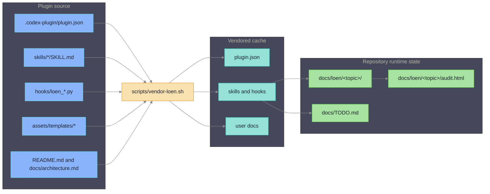
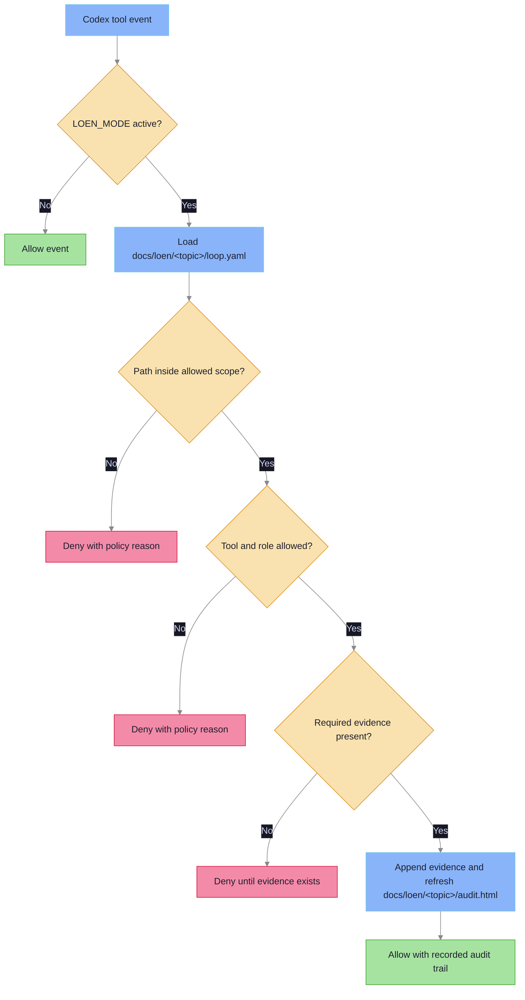
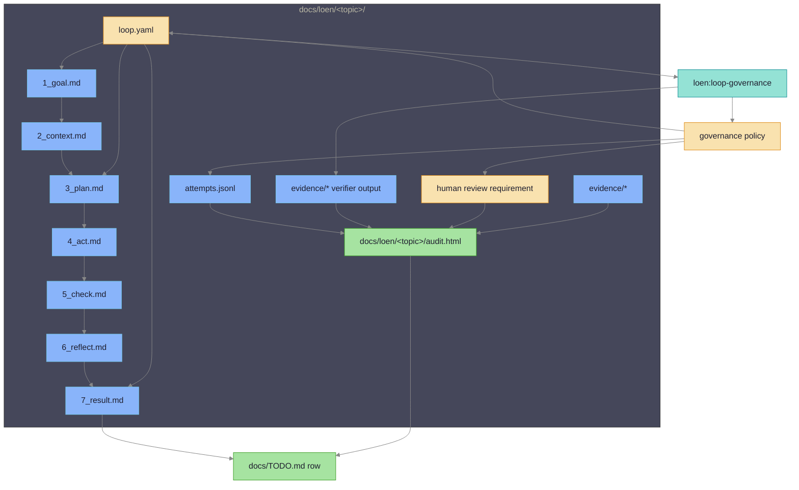

# LoEn Core Architecture

## System Map

LoEn has three boundaries: editable source assets, icodex vendored cache, and
runtime loop artifacts written by skills and hooks.



## Source Layer

The core layer establishes the editable plugin source tree. It is safe to
validate without installing the plugin into Codex because all assets are plain
JSON, Markdown, Python, TOML, YAML, and HTML files.

## Hook Assets

Hook scripts are deterministic and read only JSON tool events plus LoEn topic
artifacts such as `docs/loen/<topic>/loop.yaml`. They are source-layer plugin
assets until a later icodex integration layer installs and enables the plugin,
but their behavior is implemented and fixture-tested in this repository.

The enforcement layer owns loop-state gating, mutable/protected path checks,
tool and role policy, shell and network policy, final evidence checks, and
audit regeneration. The hooks do not depend on IDD->SDD, Superpowers, or
frontmatter review state.



## Agent Assets

Agent definitions describe role names, default write posture, artifact root, and
allowed output files. Verifier, reviewer, and researcher roles are read-only by
default.

## Runtime Boundary

Installation, launch-time wiring, cache layout, and runtime enablement are owned
by later integration layers. This source tree is not an installed plugin cache.

## Runtime Artifact Boundary

Runtime topic artifacts are repository-local and live under
`docs/loen/<topic>/`. Hooks and skills read that directory as durable loop
state so the loop can continue across context compaction, new threads,
subagents, reviews, and later automation.

`loop.yaml` is the machine-readable contract for one topic. The audit writer
regenerates `docs/loen/<topic>/audit.html` from repository artifacts and updates
the matching `docs/TODO.md` row without creating duplicate rows.



## Loop Runner

The guided runner path is:

```text
loop-start -> run contract in loop.yaml -> loop-run state machine -> result/handoff
```

`loop-start` chooses a safe topic slug, creates the topic artifacts, writes
`3_plan.md`, and waits for approval. After approval it records the runner
contract in `loop.yaml`:

- `run:` stores `mode`, `subtype`, `plan_approved`, `plan_hash`, state, pass
  budget, approval source, and approval time.
- `release_policy:` stores target branch, merge strategy, verifier requirement,
  evidence requirement, `scope_limit`, and recovery policy for merge-release.
- `governance:` stores owner, schedule, alert policy, `auto_fix`, and
  `auto_merge` for governance topics.

`loen:loop-run <topic>` validates the approved plan hash, mode, subtype, scope,
verifier, budget, and rollback or recovery policy before entering the
`prepare -> act -> check -> reflect` state machine. It stops with `handoff.md`
when approval, policy, verifier, protected scope, budget, or recovery checks fail.
It writes `7_result.md` only when terminal evidence supports completion.

Governance subtypes are `report-only`, `auto-fix`, and `merge-release`.
`report-only` records findings without product-file edits. `auto-fix` can change
only mutable scope when `governance.auto_fix: true`. `merge-release` also
requires `governance.auto_merge: true` and complete `release_policy:`.

Audit visibility stays topic-scoped: runner attempts append `attempts.jsonl`,
verifier output goes under `evidence/`, and `audit.html` is regenerated for
`docs/loen/<topic>/`. Manual `loop-plan`, `loop-act`, `loop-check`, and
`loop-reflect` remain compatible with existing topics and with users who want to
drive each stage directly.

## Agent Isolation Levels

LoEn separates role context and execution through five documented levels:

| Level | Mechanism | Purpose |
|---|---|---|
| L0 | Same session | Simple advisory use. |
| L1 | Codex subagent with context capsule | Context isolation and role separation. |
| L2 | Separate `CODEX_HOME`, worktree, and Codex profile | Stronger local split for worker and verifier runs. |
| L3 | WASM executor for deterministic tools and evals | Lightweight verifier execution isolation. |
| L4 | External heavy adapter | Future container or microVM adapter for workloads WASM cannot cover. |

The source plugin implements L1 capsule assets, L2 metadata, and a WASM-first
L3 verifier contract. It does not run container or microVM workloads in core.

## WASM-first verifier

Verifier capsules reject WASM execution configs that enable network access.
The default execution contract uses `isolation: wasm`, `executor: wasmtime`,
`network: off`, a read-only project mount, and a writable `/tmp/loen` mount for
ephemeral verifier output.

## Automation Governance

The automation-governance layer is a contract, not a scheduler. Future CI
triage, PR babysitting, dependency audit, eval governance, and cost/latency
governance integrations can call the same topic artifact APIs, but this
repository only stores deterministic policy and evidence.

Scheduled runs reuse `docs/loen/<topic>/`, append JSON records to
`attempts.jsonl`, preserve verifier evidence under `evidence/`, and regenerate
`docs/loen/<topic>/audit.html`. Existing hooks still enforce active-loop state,
protected scope, shell/network policy, evidence requirements, and `LOEN_MODE`;
automation payloads are treated as ordinary tool events with extra metadata.
