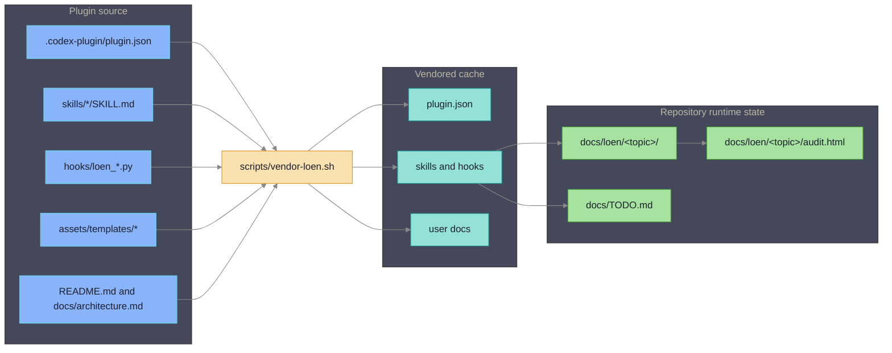
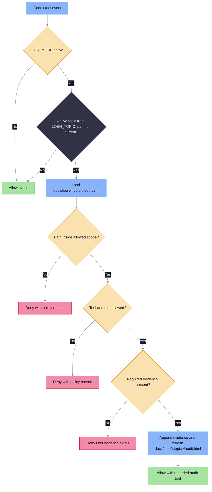
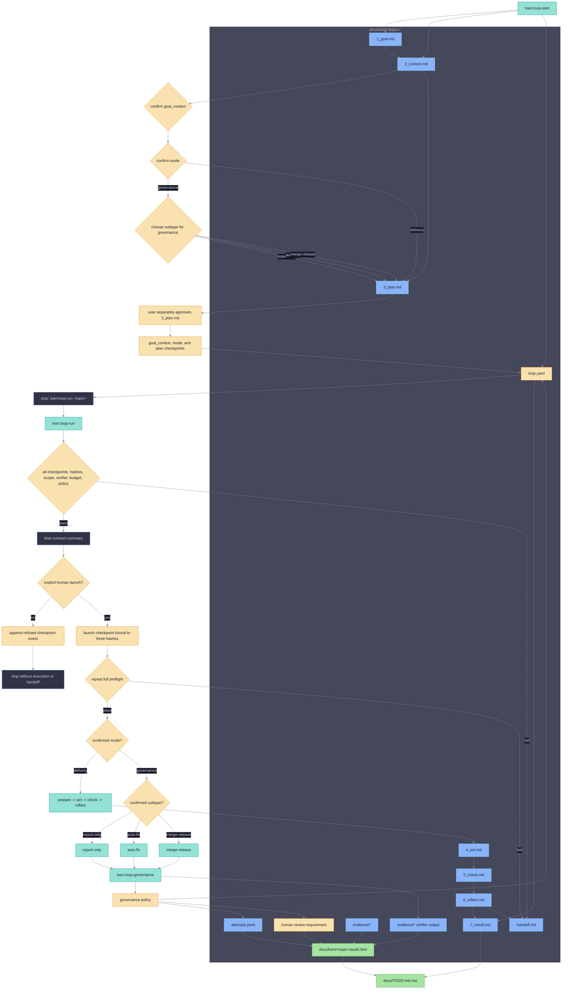

# LoEn Core Architecture

## System Map

LoEn has three boundaries: editable source assets, icodex vendored cache, and
runtime loop artifacts written by skills and hooks.



## Source Layer

The core layer establishes the editable plugin source tree. It is safe to
validate without installing the plugin into Codex because all assets are plain
JSON, Markdown, Python, TOML, YAML, and HTML files.

## Hook Assets

Hook scripts are deterministic and read only JSON tool events plus LoEn topic
artifacts such as `docs/loen/<topic>/loop.yaml`. They are source-layer plugin
assets until a later icodex integration layer installs and enables the plugin,
but their behavior is implemented and fixture-tested in this repository.

The enforcement layer owns loop-state gating, mutable/protected path checks,
tool and role policy, shell and network policy, final evidence checks, and
audit regeneration. The hooks do not depend on IDD->SDD, Superpowers, or
frontmatter review state.



## Agent Assets

Agent definitions describe role names, default write posture, artifact root, and
allowed output files. Verifier, reviewer, and researcher roles are read-only by
default.

## Runtime Boundary

Installation, launch-time wiring, cache layout, and runtime enablement are owned
by later integration layers. This source tree is not an installed plugin cache.

## Runtime Artifact Boundary

Runtime topic artifacts are repository-local and live under
`docs/loen/<topic>/`. Hooks and skills read that directory as durable loop
state so the loop can continue across context compaction, new threads,
subagents, reviews, and later automation.

`loop.yaml` is the machine-readable contract for one topic. The audit writer
regenerates `docs/loen/<topic>/audit.html` from repository artifacts and updates
the matching `docs/TODO.md` row without creating duplicate rows.



## Loop Runner

The guided runner path is:

```text
loop-start -> goal/context checkpoint -> mode checkpoint -> plan checkpoint -> stop
loop-run invocation -> prelaunch check -> explicit launch checkpoint -> repeated preflight -> result/handoff
```

`loop-start` adaptively develops a safe topic and its objective, observable
outcome, success criteria, constraints, scope, verifier, budget, and recovery
policy. It first presents goal/context for explicit confirmation, then requires
an explicit delivery or governance choice and governance subtype. Initial
planning is integrated into start and has its own approval. Start never invokes
the runner or offers immediate execution; it stops with the exact command
`loen:loop-run <topic>`.

`loop.yaml` stores current structured authority:

- `checkpoints.goal_context` stores confirmation plus goal and context hashes.
- `checkpoints.mode` stores explicit mode and subtype confirmation.
- `checkpoints.plan` stores separate approval plus the plan hash.
- `checkpoints.launch` stores separate human launch confirmation bound to the
  current goal, context, and plan hashes.
- `run:` stores progress fields only, including state and pass counters.
- `release_policy:` stores target branch, merge strategy, verifier requirement,
  evidence requirement, `scope_limit`, and recovery policy for merge-release.
- `governance:` stores owner, schedule, alert policy, `auto_fix`, and
  `auto_merge` for governance topics.

`attempts.jsonl` is append-only audit history for checkpoint confirmations,
invalidations, refusals, and execution attempts. Historical events are never
current authority and cannot restore a checkpoint invalidated in `loop.yaml`.

| Deterministic change | Invalidated checkpoints |
|---|---|
| `1_goal.md` or `2_context.md` content changes | `goal_context`, `mode`, `plan`, `launch` |
| Confirmed mode or subtype changes | `mode`, `plan`, `launch` |
| `3_plan.md` content changes or standalone replan begins | `plan`, `launch` |
| Any launch-bound hash changes | `launch` |

Standalone `loen:loop-plan <topic>` is only for replanning an existing topic. It
validates confirmed upstream goal/context and mode state, resets plan and launch,
writes a fresh `3_plan.md`, and requires fresh plan approval. It is not a step in
the primary `loop-start` flow.

Invoking `loen:loop-run <topic>` is not launch confirmation. The runner validates
the three upstream checkpoints, hashes, scope, verifier, budget, and policy, then
presents a final contract summary. A separate explicit human decision records
the launch checkpoint and its three hashes. The runner immediately repeats full
preflight and enters `prepare -> act -> check -> reflect` only if it still
passes; otherwise it refuses and records recovery guidance. It writes
`7_result.md` only when terminal evidence supports completion.

Runner preflight treats placeholder scope values as absent. A topic with
`mutable_scope: [none]`, `mutable_scope: [null]`, or only empty strings does not
have a usable mutable scope and must hand off before acting.

Governance subtypes are `report-only`, `auto-fix`, and `merge-release`.
`report-only` records findings without product-file edits. `auto-fix` can change
only usable mutable scope when `governance.auto_fix: true`. `merge-release` also
requires the universal launch checkpoint, repeated preflight,
`governance.auto_merge: true`, and complete `release_policy:`.

`merge-release` release policy is complete only when it has a target branch,
merge strategy, verifier requirement, evidence requirement, non-empty
`scope_limit`, and recovery policy. `scope_limit` is the release-specific
boundary used to constrain merge/release automation; it does not replace
`mutable_scope`, and both must be usable before the runner may proceed.

Legacy contracts without `checkpoints` are refused as an intentional breaking
change. There is no migration, inferred approval, compatibility flag, or
grandfathering. Recovery is explicit renewal through `loen:loop-start`, followed
by `loen:loop-run <topic>` after plan approval.

Audit visibility stays topic-scoped: runner attempts append `attempts.jsonl`,
verifier output goes under `evidence/`, and `audit.html` is regenerated for
`docs/loen/<topic>/`. Manual `loop-act`, `loop-check`, and `loop-reflect` remain
available to users who want to drive stages directly; standalone `loop-plan`
retains only the existing-topic replan role described above.

## Agent Isolation Levels

LoEn separates role context and execution through five documented levels:

| Level | Mechanism | Purpose |
|---|---|---|
| L0 | Same session | Simple advisory use. |
| L1 | Codex subagent with context capsule | Context isolation and role separation. |
| L2 | Separate `CODEX_HOME`, worktree, and Codex profile | Stronger local split for worker and verifier runs. |
| L3 | WASM executor for deterministic tools and evals | Lightweight verifier execution isolation. |
| L4 | External heavy adapter | Future container or microVM adapter for workloads WASM cannot cover. |

The source plugin implements L1 capsule assets, L2 metadata, and a WASM-first
L3 verifier contract. It does not run container or microVM workloads in core.

## WASM-first verifier

Verifier capsules reject WASM execution configs that enable network access.
The default execution contract uses `isolation: wasm`, `executor: wasmtime`,
`network: off`, a read-only project mount, and a writable `/tmp/loen` mount for
ephemeral verifier output.

## Automation Governance

The automation-governance layer is a contract, not a scheduler. Future CI
triage, PR babysitting, dependency audit, eval governance, and cost/latency
governance integrations can call the same topic artifact APIs, but this
repository only stores deterministic policy and evidence.

Scheduled runs reuse `docs/loen/<topic>/`, append JSON records to
`attempts.jsonl`, preserve verifier evidence under `evidence/`, and regenerate
`docs/loen/<topic>/audit.html`. Existing hooks still enforce active-topic loop
state, protected scope, shell/network policy, evidence requirements, and
`LOEN_MODE`; automation payloads are treated as ordinary tool events with extra
metadata.
